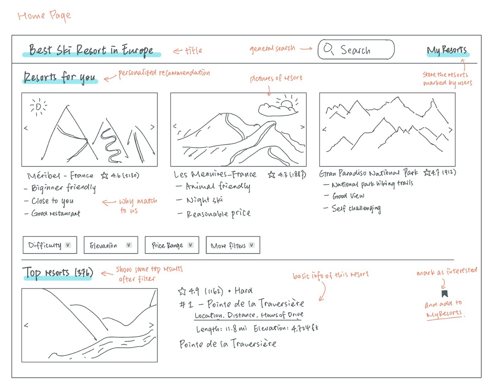
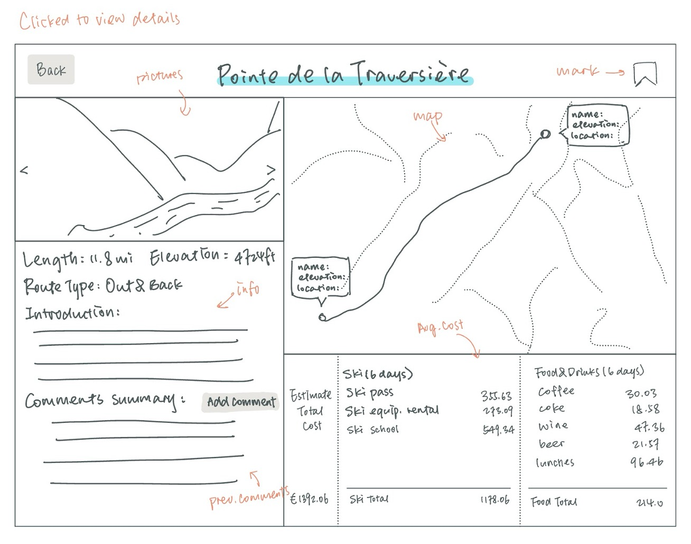

# SkiSearch

> European Ski Resort Search Platform

## Project Summary

The European Ski Resort Search Platform is a comprehensive tool designed to help skiers find the best resorts in Europe. Our app allows users to search for ski resorts based on key factors such as location, slope difficulty, and cost. In addition, users can rate and review resorts based on their personal experiences. The platform aims to enhance the skiing experience by making it easier for skiers to discover and filter resorts that align with their preference.

## Description

Our goal is to develop an integrated platform specifically tailored to help skiers choose the ideal ski resort. Skiers often prioritize factors like location, the difficulty of slopes, and resort pricing, so our platform will offer detailed information on these aspects to help users make informed decisions. Additionally, the platform will feature an AI-powered comment analysis system that summarizes user reviews, providing insights into the strengths and weaknesses of each resort.

The ski resort dataset for this project includes detailed information on approximately 400 ski resorts across Europe. We also incorporate a dataset containing pricing details for food, equipment, and other amenities at each resort. This application addresses the challenges skiers face when planning a trip by offering a centralized system to manage and update resort information, making it easy to find everything needed in one place.

## Creative Component

To enhance our ski resort recommendation application, we propose integrating an AI API that summarizes user comments for each resort. The AI will analyze the feedback and create concise "pros" and "cons" lists, giving users a quick overview of each resort’s highlights and drawbacks. This feature will save users time by making it easier for them to evaluate their options based on other visitors’ experiences. The use of AI also ensures that the summaries are updated automatically as new comments are added, making the feature dynamic and up-to-date.

## Usefulness

Our app is designed to help skiers find the best ski resorts in Europe for the best skiing experience. Users can filter and select ski resorts based on multiple factors such as European countries, ski slope prices, ski slope difficulty, food and beverage and ski equipment rental prices. This comprehensive consideration allows users to better plan their ski trips to ensure that they meet their needs not only in terms of skiing, but also in terms of the overall experience. The information provided for each ski resort not only covers skiing conditions, but also nearby food and beverage prices and ski equipment rental prices, allowing users to budget in advance and choose the most satisfactory ski resort.

While global websites such as alltrails.com also provide ski resort information, our app is more focused on European ski resorts and digs deeper into all aspects of the skiing experience. Unlike only providing basic ski slope information, we provide users with information on European ski resorts, as well as introductions to ski resort facilities and food and beverage costs. Our app can provide skiers with more comprehensive and practical information when searching for the ideal ski resort in Europe.

## Realness

Our application is built on real datasets to help users find the best ski resorts in Europe.

European Ski Resorts Dataset (Kaggle link: https://reurl.cc/E6vZNA): This dataset is sourced from Kaggle and is in CSV format. It provides comprehensive data on various European ski resorts, including details such as resort name, country, highest and lowest points, day pass price, and slope difficulties. The dataset contains around 400 unique ski resorts, and it has a degree of 18.

Ski Resort Cost Data (Statista): The second dataset comes from Statista, also in CSV format. It provides real cost data for European ski resorts, including ski pass prices, ski/boot hire costs, and nearby food and drink prices. This dataset has a cardinality of around 400, and a degree of 12, capturing various cost-related attributes.

## Functionality

Our app is specifically designed for skiers seeking the best ski resorts in Europe, providing a personalized experience to help users plan their skiing trip. The platform offers a range of functionalities to enhance the user experience, including:

1. **Resort Information**: Offers detailed information on various ski resorts across Europe, including descriptions, amenities, weather conditions, and user reviews, allowing skiers to choose the best resort for their preferences and needs.

2. **Filter and Search Options**: Enables users to filter and search ski resorts based on multiple factors, such as location (by European country), ski slope prices, difficulty levels of the slopes, food and beverage options, and ski equipment rental prices.

3. **Ski Slope Details**: Provides specific details about ski slopes at each resort, including the number of slopes, their difficulty levels (beginner, intermediate, advanced), and the total length of slopes, helping users choose resorts that match their skill levels and preferences.

4. **Price Comparison**: Displays a comprehensive comparison of prices for ski slopes, equipment rentals, and food and beverages across various resorts, allowing users to find options that fit their budget.

5. **User Ratings and Reviews**: Allows users to rate and review resorts based on their skiing experience, slope quality, amenities, and services, helping other users make informed decisions.

6. **Weather and Snow Conditions**: Provides real-time updates on weather and snow conditions at different ski resorts, enabling users to plan their trips according to optimal skiing conditions.

7. **Customized Trip Planner**: Users can create customized ski trips by selecting multiple resorts, setting preferred slope difficulties, and adding nearby dining and accommodation options to their itinerary.

By integrating these functionalities, our app aims to be the ultimate guide for skiers looking to find the best skiing experiences in Europe, offering a comprehensive platform to plan and enjoy their ski trips efficiently and enjoyably.

## Low Fidelity UI Mockup

The UI will be designed to provide a user-friendly experience, with easy navigation and visually appealing representations of data.

#### Main Page

The main page serves as a gateway to all the features offered by the SkiSearch platform, presenting a dynamic mix of popular ski resorts, personalized recommendations, and filters to help users find resorts based on their preferences. A navigation bar at the top ensures easy access to other sections of the site.

#### Resort Detail Page

The detail pages provide comprehensive information about the resorts users are interested in, including ratings, reviews, slope details, and pricing. Skiers can also contribute their own comments based on personal experiences. The system will then summarize all feedback, highlighting the strengths and weaknesses of each resort.

## Work Distribution

Our tentative work distribution is as follows:

- **Yu-Tao Sun**: Responsible for developing the frontend of the application, as well as database management.
- **Jing Li**: Responsible for dataset collection and organization, as well as database management.
- **Ziqi Liu**: Responsible for designing and developing backend application, and overseeing the overall development of the application.
- **Yutong Chen**: Responsible for developing the backend of the application and APIs implementation.
