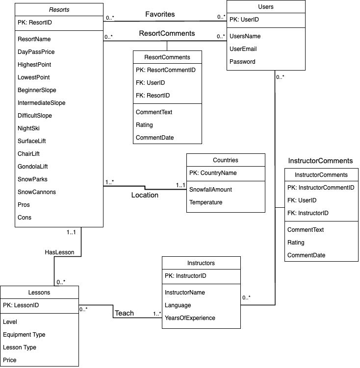

# Database conceptual design

## UML diagram



## Entities

There are a total of 5 entities for our database design. Each is explained in detail as follows.

### 1. Resorts

This is an entity regarding ski resort information, with 16 attributes.

1. **ResortID**: a unique identifier to distinguish between resorts. This should be a numeric attribute and primary key for this table.
2. ResortName: a string attribute, the name of the resort.
3. DayPassPrice: a numeric attribute, the price for day pass ticket.
4. HighestPoint: a numeric attribute, the height of the highest point of the resort.
5. LowestPoint: a numeric attribute, the height of the lowest point of the resort.
6. BeginnerSlope: a numeric attribute, the amount of slopes for beginners.
7. IntermediateSlope: a numeric attribute, the amount of slopes for intermediate level.
8. DifficultSlope: a numeric attribute, the amount of slopes for difficult level.
9. NightSki: a boolean attribute, indicating whether the resort offer night ski (TRUE) or not (FALSE).
10. SurfaceLift: a numeric attribute, the amount of surface lift in the resort.
11. ChairLift: a numeric attribute, the amount of chair lift in the resort.
12. GondolaLift: a numeric attribute, the amount of gondola lift in the resort.
13. SnowParks: a boolean attribute, indicating whether the resort is a snow park (TRUE) or not (FALSE).
14. SnowCannons: a numeric attribute, the amount of snow cannons in the resort.
15. Pros: a string attribute, the positive comments summarized by AI.
16. Cons: a string attribute, the negative comments summarized by AI.

This entity is designed according to the assumptions:

1. Every resort in this platform will have a unique ResortID and cannot be modified.
2. The pros and cons will be updated if there are new comments on the resort.

### 2. Countries

This is an entity regarding country information, with three attributes.

1. **CountryName**: a unique identifier to distinguish between countries. This should be a string attribute and primary key for this table.
2. SnowfallAmount: a numeric attribute, the average amount of snaowfall in the country during winter.
3. Temperature: a numeric attribute, the average temperature of the country in winter.

This entity is designed according to the assumptions:

1. Every country in this platform will have a unique country name and cannot be modified.
2. We put country information into a seperate table because a country may have multiple resorts. Referencing a different table will remove redundancy.

### 3. Instructors

This is an entity regarding instructor information, with four attributes.

1. **InstructorID**: a unique identifier to distinguish between instructors. This should be a numeric attribute and primary key for this table.
2. InstructorName: a string attribute, the name of the instructor.
3. Language: a string attribute, the language spoken by the instructor.
4. YearsOfExperience: a numeric attribute, years of teaching experience of the instructor.

This entity is designed according to the assumptions:

1. Every instructor in this platform will have a unique InstructorID and cannot be modified.
2. We put instructor information into a seperate table because a instructor may teach multiple lessons. Referencing a different table will remove redundancy.

### 4. Lessons

This is an entity regarding ski lesson information, with five attributes.

1. LessonID: a unique identifier to distinguish between lessons. This should be a numeric attribute and primary key for this table.
2. Level: a string attribute, the level of the lesson. There are currently three choices: beginner, intermediate, and difficult.
3. LessonType: a string attribute, the type of the lesson. There are currently two choices: group and individual.
4. EquipmentType: a string attribute, the type of equipment taught in the lesson. There are currently two choices: ski and snowboard.
5. Price: a numeric attribute, the price of the lesson.

This entity is designed according to the assumptions:

1. Every lesson in this platform will be determined by a unique combination of level, lesson type, equipment type, resort ID, and instructor ID.
2. We put lesson information into a seperate table because a resort may have multiple lessons. Referencing a different table will remove redundancy.

### 5. Users

This is an entity regarding user login information, with four attributes.

1. **UserID**: a unique identifier to distinguish between users. This should be a string attribute and primary key for this table.
2. UserName: a string attribute, the name of the user.
3. UserEmail: a string attribute, the email address of the user.
4. Password: a string attribute, password for login the platform.

This entity is designed according to the assumptions:

1. Every user in this platform will have a unique UserID and cannot be modified.
2. Users can change their password, which is the only allowed update operation for this entity table.
3. Once the user entered the UserName or UserEmail and Password, the system will automatically log in and to home page.

## Relations

There are a total of 6 relations in our database design, which will addressed in details as follows:

### 1. ResortComments

#### Relationship

- This is a relation between `Resorts` and `Users` to record comments that users make on each resort, with 6 attributes.

#### Attributes

- ResortCommentID: Primary key, an integer attribute uniquely identifies each comment.
- UserID: Foreign key linking to the Users table, an integer attribute that indicate which user made the comment.
- ResortID: Foreign key linking to the Resorts table, an integer attribute that indicate which resort the comment is about.
- CommentText: The text of the comment, a string attribute.
- Rating: The rating given to the resort, an integer attribute.
- CommentDate: The date the comment was made, a string attribute.

#### Cardinality

- **Users to Resorts**: Many-to-Many(1 resort can receive multiple comments from users, and users could make comments to multiple resorts).

#### Assumption

- Each comment is uniquely identified by ResortCommentID and cannot be modified.
- A user can leave multiple comments on the same or different resorts, and a resort can receive comments from multiple users.
- Comments are considered immutable once created; the system does not provide a mechanism for users to modify or delete their comments.

### 2. InstructorComments

#### Relationship

- This is a relation between `Instructors` and `Users` to store comments that users leave for each instructor, with 6 attributes.

#### Attributes

- InstructorCommentID: Primary key, a numeric attribute that uniquely identifies each comment.
- UserID: Foreign key linking to the Users table, a numeric attribute that indicates which user made the comment.
- InstructorID: Foreign key linking to the Instructors table, a numeric attribute that indicates which instructor the comment is about.
- CommentText: The text of the comment, a string attribute.
- Rating: The rating given to the instructor, a numeric attribute.
- CommentDate: The date the comment was made, a string attribute.

#### Cardinality

- **Users to Instructors**: Many-to-Many (1 Instructor can receive multiple comments from users, and users could make comments to multiple Instructors).

#### Assumption

- Each comment is uniquely identified by InstructorCommentID and cannot be modified.
- A user can leave multiple comments on the same or different instructors, and an instructor can receive comments from multiple users.
- Comments are assumed to be final once submitted; users do not have the option to modify or delete their comments.

### 3. Teach

#### Relationship

- This is a relation between `Instructors` and `Lessons` to represent which lessons are taught by which instructors, with 2 attibutes.

#### Attributes

- InstructorID: Primary key and foreign key linking to the Instructors table, a numeric attribute that identify the instructor.
- LessonID: Primary key and foreign key linking to the Lessons table, a numeric attribute that identify the lesson taught.

#### Cardinality

- **Instructors to Lessons**: Many-to-Many (1 Lesson can be taught by multiple Instructors, and 1 instructor can teach multiple lesson).

#### Assumption

- This is a many-to-many relationship because an instructor can teach multiple lessons, and each lesson can be taught by multiple instructors.
- The composite primary key ensures that each teaching pair is unique, preventing duplicate entries for the same instructor-lesson pair.

### 4. Favorites

#### Relationship

- This is a relation between `Users` and `Resorts` to track the resorts that each user has marked as a favorite, with 2 attibutes.

#### Attributes

- UID: Primary key and foreign key linking to the Users table, a string attribute that indicates the user who marked the resort as a favorite.
- ResortID: Primary key and foreign key linking to the Resorts table, a numeric attribute that indicates the resort marked as a favorite.

#### Cardinality

- **Users to Resorts**: Many-to-Many (1 Resort can be favored by many Users, and each user could favorite many resorts).

#### Assumption

- Each user can favorite multiple resorts, and each resort can be favorited by multiple users, representing a many-to-many relationship.
- The combination of UserID and ResortID forms a composite primary key, ensuring that a user can mark each resort as a favorite only once.

### 5. Location

#### Relationship

- This is a relation between `Countries` and `Resorts` to indicate the country in which each resort is located, with 2 attributes.

#### Attributes

- CountryName: Primary key and foreign key linking to the Country table, a string attribute that identify the country.
- ResortID: Primary key and foreign key linking to the Resorts table, an integer attribute that identifies the resort located in the country.

#### Cardinality

- **Country to Resorts**: 1-to-Many (1 Resort is located in one Country, but each Country could contain multiple resorts).

#### Assumption

- A country can have multiple resorts, but each resort is located in only one country, representing a one-to-many relationship.
- The combination of CountryName and ResortID forms a composite primary key, ensuring that a resort can be associated with a specific country only once.

### 6. HasLesson

#### Relationship

- This is a relation between `Lessons` and `Resorts` to identify which lessons are offered by which resorts, with 2 attributes.

#### Attributes

- LessonID: Primary key and foreign key linking to the Lessons table, an integer attribute that indicates the lesson offered.
- ResortID: ResortID: Primary key and foreign key linking to the Resorts table, an integer attribute that indicates the resort offering the lesson.

#### Cardinality

- **Lessons to Resorts**: 1-to-Many (1 Resort can offer many Lessons, but each Lesson could only be offered by one resort).

#### Assumption

- A resort can offer multiple lessons, and each lesson can be offered by multiple resorts, representing a many-to-many relationship.
- The combination of LessonID and ResortID forms a composite primary key, ensuring that each lesson-resort pairing is unique.

## BCNF

#### Entities

1. **Users**: This table is in BCNF. In this table, UserID is the primary key, and all other attributes (UserName, UserEmail, Password) depend solely on UserID. Also, there are no other dependencies between the non-key attributes and UserID is a superkey.

- {UserID} → All other attributes

2. **Countries**: This table is in BCNF. In this table, CountryName is the primary key, and all other attributes (SnowfallAmount, Temperature) depend solely on CountryName. Also there are no dependencies between the non-key attributes and CountryName is a superkey.

- {CountryName} → All other attributes

3. **Lessons**: This table is in BCNF. In this table, LessonID is the primary key, and it uniquely identifies each lesson. All other attributes (Level, LessonType, EquipmentType, Price) depend solely on LessonID. There are no dependencies between the non-key attributes, and since all functional dependencies have a superkey (LessonID) as their determinant, the table is in BCNF.

- {LessonID} → All other attributes

4. **Instructors**: This table is in BCNF. In this table, InstructorID is the primary key, and all other attributes (InstructorName, Language, YearsOfExperience) depend solely on InstructorID. There are no dependencies between the non-key attributes, and InstructorID is a superkey.

- {InstructorID} → All other attributes

5. **Resorts**: This table is in BCNF. In this table, ResortID is the primary key, and all other attributes (ResortName, DayPassPrice, HighestPoint, LowestPoint, BeginnerSlope, IntermediateSlope, DifficultSlope, NightSki, SurfaceLift, ChairLift, GondolaLift, SnowParks, SnowCannons, Pros, Cons) depend solely on ResortID. There are no dependencies between the non-key attributes, and ResortID is a superkey.

- {ResortID} → All other attributes

#### Relations

1. **ResortComments**: This table is in BCNF. In this table, ResortCommentID is the primary key, and all other attributes (UserID, ResortID, CommentText, Rating, CommentDate) depend solely on ResortCommentID. There are no dependencies between the non-key attributes, and ResortCommentID is a superkey.

- {ResortCommentID} → All other attributes

2. **InstructorComments**: This table is in BCNF. In this table, InstructorCommentID is the primary key, and all other attributes (UserID, InstructorID, CommentText, Rating, CommentDate) depend solely on InstructorCommentID. There are no dependencies between the non-key attributes, and InstructorCommentID is a superkey.

- {InstructorCommentID} → All other attributes

3. **Teach**: This table is in BCNF. In this table, the composite key {InstructorID, LessonID} serves as the primary key, and there are no other attributes. Therefore, all functional dependencies have a superkey as their determinant.

- {InstructorID, LessonID} → (InstructorID, LessonID)

4. **Favorites**: This table is in BCNF. In this table, the composite key {UserID, ResortID} serves as the primary key, and there are no other attributes. Therefore, all functional dependencies have a superkey as their determinant.

- {UserID, ResortID} → (UserID, ResortID)

We chose to apply BCNF as it is stricter and ensures that all data dependencies make sense. All the tables and relations in your schema are already in BCNF, which means your database schema is highly normalized.

By adhering to BCNF, you ensure that the database schema has the following advantages:

1. Minimizes redundancy
2. Simplifies the enforcement of referential integrity constraints
3. Eases the data maintenance and ensures data integrity

## Relational Schema

The database design will be converted into 9 tables.

**1. Resorts**

```mysql
Resorts(
    ResortID INT [PK],
    CountryName VARCHAR(255) [FK to Countries.CountryName],
    ResortName VARCHAR[255],
    DayPassPrice INT,
    HighestPoint INT,
    LowestPoint INT,
    BeginnerSlope INT,
    IntermediateSlope INT,
    DifficultSlope INT,
    NightSki Bool,
    SurfaceLift INT,
    ChairLift INT,
    GondolaLift INT,
    SnowParks Bool,
    SnowCannons INT,
    Pros VARCHAR(255),
    Cons VARCHAR(255)
)
```

**2. Countries**

```mysql
Countries(
    CountryName VARCHAR(255) [PK],
    SnowfallAmount REAL,
    Temperature REAL
)
```

**3. Instructors**

```mysql
Instructors(
    InstructorID INT [PK],
    InstructorName VARCHAR(255),
    Language VARCHAR(255),
    YearsOfExperience REAL
)
```

**4. Lessons**

```mysql
Lessons(
    LessonID VARCHAR(255) [PK],
    ResortID INT [FK to Resorts.ResortID],
    Level VARCHAR(255),
    LessonType VARCHAR(255),
    EquipmentType CHAR(10),
    Price INT
)
```

**5. Users**

```mysql
Users(
    UserID VARCHAR(255) [PK],
    UsersName VARCHAR(255),
    UserEmail VARCHAR(255),
    Password VARCHAR(255)
)
```

**6. Favorites**

```mysql
Favorites (
	UserID VARCHAR(255) [PK, FK to Users.UserID],
	ResortID INT [PK, FK to Resorts.ResortID]
)
```

**7. ResortComments**

```mysql
ResortComments (
	ResortCommentID INT [PK],
	UserID INT [FK to Users.UserID],
	ResortID INT [FK to Resorts.ResortsID],
	CommentText VARCHAR(255),
   	Rating INT,
    CommentDate VARCHAR(255)
)
```

**8. InstructorComments**

```mysql
InstructorComments (
	InstructorCommentID INT [PK],
	UserID INT [FK to Users.UserID],
	InstructorID INT [FK to Instructors.InstructorID],
	CommentText VARCHAR(255),
   	Rating INT,
    CommentDate VARCHAR(255)
)

```

**9. Teach**

```mysql
Teach (
	InstructorID INT [PK, FK to Instructors.InstructorID],
	LessonID INT [PK, FK to Lessons.LessonID]
)
```
