# Database Design

## Database Tables on GCP

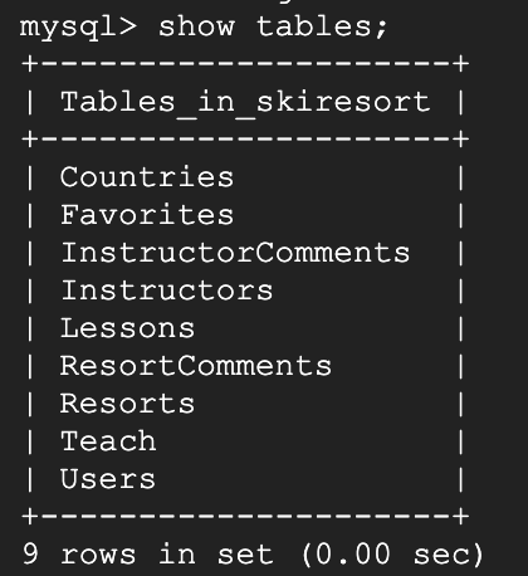

three tables with at least 1000 rows:

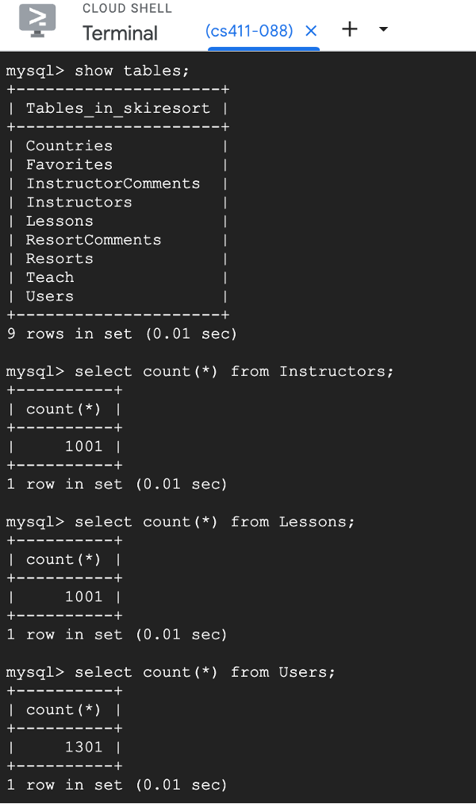

## DDL Commands

```sql
-- Resort Info Table
CREATE TABLE Resorts(
    ResortID INT PRIMARY KEY,
    CountryName VARCHAR(255) NOT NULL,
    ResortName VARCHAR(255),
    DayPassPrice INT,
    HighestPoint INT,
    LowestPoint INT,
    BeginnerSlope INT,
    IntermediateSlope INT,
    DifficultSlope INT,
    NightSki BOOLEAN,
    SurfaceLift INT,
    ChairLift INT,
    GondolaLift INT,
    SnowParks BOOLEAN,
    SnowCannons INT,
    Pros VARCHAR(255),
    Cons VARCHAR(255),
    FOREIGN KEY (CountryName) REFERENCES Countries(CountryName)
        ON DELETE CASCADE ON UPDATE CASCADE
);


-- Country Info Table
CREATE TABLE Countries(
    CountryName VARCHAR(255) PRIMARY KEY,
    SnowfallAmount REAL,
    Temperature REAL
);


-- Instructor Info Table
CREATE TABLE Instructors(
    InstructorID INT PRIMARY KEY,
    InstructorName VARCHAR(255),
    Language VARCHAR(255),
    YearsOfExperience REAL
);


-- Lesson Info Table
CREATE TABLE Lessons(
    LessonID VARCHAR(255) PRIMARY KEY,
    ResortID INT NOT NULL,
    Level VARCHAR(255),
    LessonType VARCHAR(255),
    EquipmentType CHAR(10),
    Price INT,
    FOREIGN KEY (ResortID) REFERENCES Resorts(ResortID)
        ON DELETE CASCADE ON UPDATE CASCADE
);


-- User Info Table
CREATE TABLE Users(
    UserID VARCHAR(255) PRIMARY KEY,
    UsersName VARCHAR(255),
    UserEmail VARCHAR(255),
    Password VARCHAR(255)
);


-- Favorites Table
CREATE TABLE Favorites (
    UserID VARCHAR(255),
    ResortID INT,
    PRIMARY KEY (UserID, ResortID),
    FOREIGN KEY (UserID) REFERENCES Users(UserID)
        ON DELETE CASCADE ON UPDATE CASCADE,
    FOREIGN KEY (ResortID) REFERENCES Resorts(ResortID)
        ON DELETE CASCADE ON UPDATE CASCADE
);


-- Resort Comments Table
CREATE TABLE ResortComments (
    ResortCommentID INT PRIMARY KEY,
    UserID VARCHAR(255),
    ResortID INT,
    CommentText VARCHAR(255),
    Rating INT,
    CommentDate VARCHAR(255),
    FOREIGN KEY (UserID) REFERENCES Users(UserID)
        ON DELETE CASCADE ON UPDATE CASCADE,
    FOREIGN KEY (ResortID) REFERENCES Resorts(ResortID)
        ON DELETE CASCADE ON UPDATE CASCADE
);


-- Instructor Comments Table
CREATE TABLE InstructorComments (
    InstructorCommentID INT PRIMARY KEY,
    UserID VARCHAR(255),
    InstructorID INT,
    CommentText VARCHAR(255),
    Rating INT,
    CommentDate VARCHAR(255),
    FOREIGN KEY (UserID) REFERENCES Users(UserID)
        ON DELETE CASCADE ON UPDATE CASCADE,
    FOREIGN KEY (InstructorID) REFERENCES Instructors(InstructorID)
        ON DELETE CASCADE ON UPDATE CASCADE
);


-- Teach Table
CREATE TABLE Teach (
    InstructorID INT,
    LessonID VARCHAR(255),
    PRIMARY KEY (InstructorID, LessonID),
    FOREIGN KEY (InstructorID) REFERENCES Instructors(InstructorID)
        ON DELETE CASCADE ON UPDATE CASCADE,
    FOREIGN KEY (LessonID) REFERENCES Lessons(LessonID)
        ON DELETE CASCADE ON UPDATE CASCADE
);

```

## Advanced Queries

### Query 1

Find the average highest point for each country that has resorts, but only include countries where the average highest point is above the overall average highest point across all resorts.

```sql
SELECT C.CountryName, AVG(R.HighestPoint) AS AvgHighestPoint
FROM Countries C
JOIN Resorts R ON C.CountryName = R.CountryName
GROUP BY C.CountryName
HAVING AvgHighestPoint > (
    SELECT AVG(HighestPoint) FROM Resorts
)
ORDER BY AvgHighestPoint DESC
limit 15;
```

There are only 8 rows in the result.

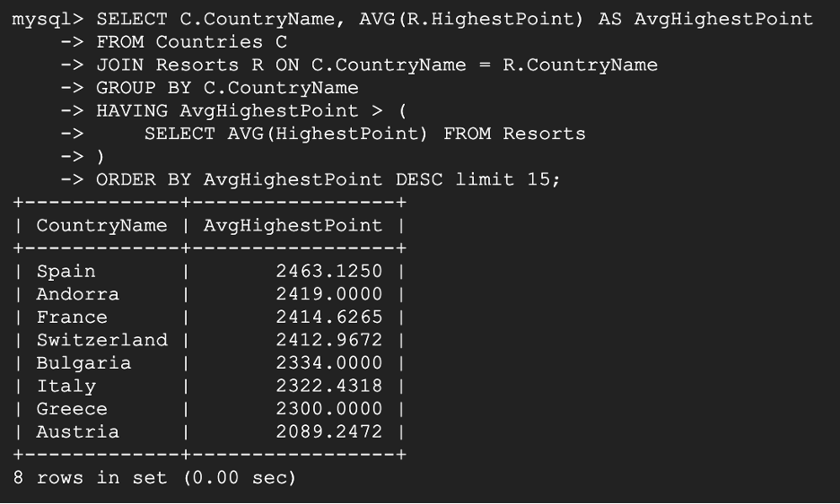

### Query 2

List all unique countries that either have resorts with snow parks or have an average SnowFallAmount above 100 cm.

```sql
SELECT DISTINCT CountryName
FROM Resorts
WHERE SnowParks = 1

UNION

SELECT C.CountryName
FROM Countries C
JOIN Resorts R ON C.CountryName = R.CountryName
GROUP BY C.CountryName
HAVING AVG(C.SnowfallAmount) > 100
limit 15;
```

There are only 8 rows in the result.

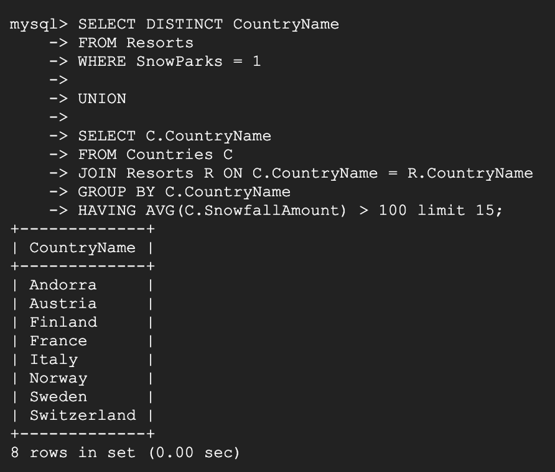

### Query 3

Find the names of resorts that have more than 10 intermediate slopes and are located in countries with above-average snowfall.

```sql
SELECT R.ResortName, R.IntermediateSlope
FROM Resorts R
JOIN Countries C ON R.CountryName = C.CountryName
WHERE R.IntermediateSlope > 10
    AND C.SnowfallAmount > (
        SELECT AVG(SnowfallAmount) FROM Countries
        )
ORDER BY R.IntermediateSlope DESC
limit 15;
```

There are only 8 rows in the result.

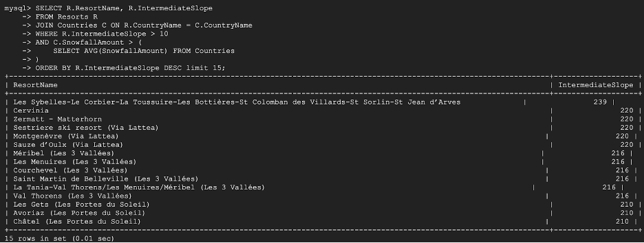

### Query 4

List all resorts and their countries where either the resort has beginner slopes greater than 5, or the resort’s country has the highest snowfall amount among all countries with at least one resort.

```sql
SELECT R.ResortName, R.CountryName
FROM Resorts R
WHERE R.BeginnerSlope > 5

UNION

SELECT R.ResortName, R.CountryName
FROM Resorts R
JOIN Countries C ON R.CountryName = C.CountryName
WHERE C.SnowfallAmount = (
    SELECT MAX(SnowfallAmount)
    FROM Countries
    WHERE CountryName IN (SELECT DISTINCT CountryName FROM Resorts)
)
limit 15;
```

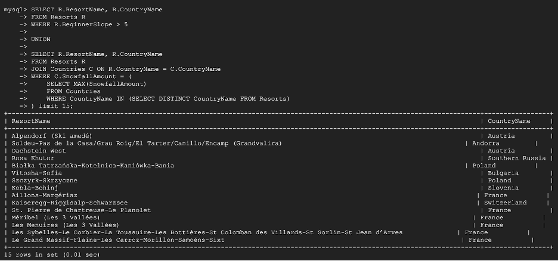

## Index Analysis

### Query 1

- Default Index:

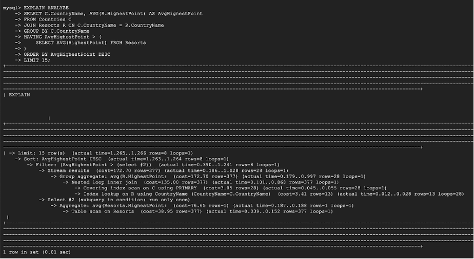

We first ran the EXPLAIN ANALYZE command on the original advanced query to measure its performance and the cost was 172.70.

- Add an index on HighestPoint:

This column is used in the HAVING clause and plays a key role in the aggregation function AVG(HighestPoint). Indexing this column was expected to speed up the process of calculating the average by allowing the database to quickly locate the values needed for aggregation.

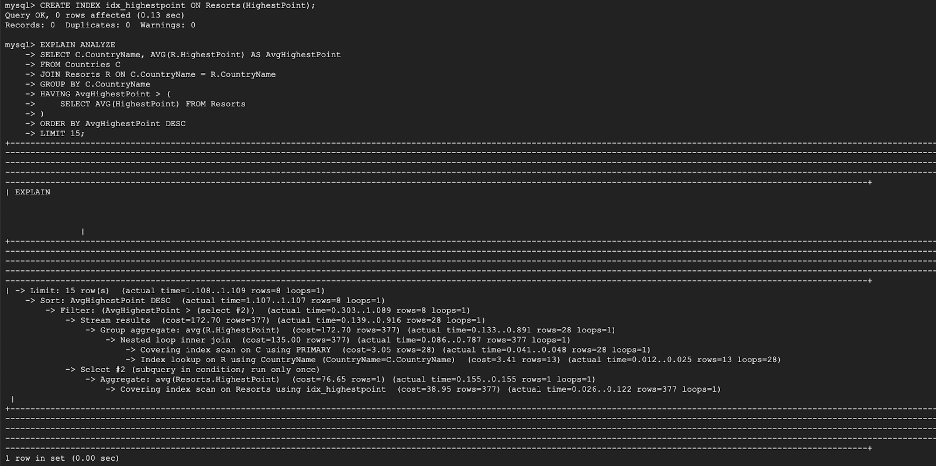

However, after testing, the query cost remained unchanged likely because HighestPoint contains mostly unique values. In cases like this, an index provides little benefit as the database still has to process nearly all rows.

- Add an composite index on CountryName and HighestPoint:

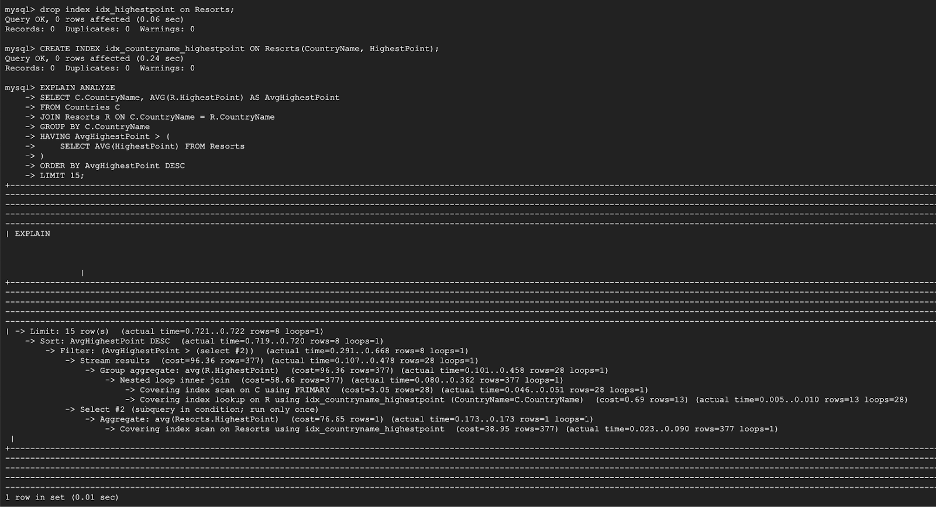

After creating the composite index on CountryName and HighestPoint, the query cost dropped from 172.70 to 96.36, which is a big improvement. The cost of the nested loop join also went down from 135.00 to 58.66, which means that the index helped speed up the join between Countries and Resorts. The query now uses the index for lookups, reducing the need for scanning the entire table.

- Add an Index on CountryName:
  
This column is used in the JOIN clause to connect the Countries table with the Resorts table (ON C.CountryName = R.CountryName). Indexing this column is expected to improve the performance of the JOIN operation by allowing faster lookups for matching rows.

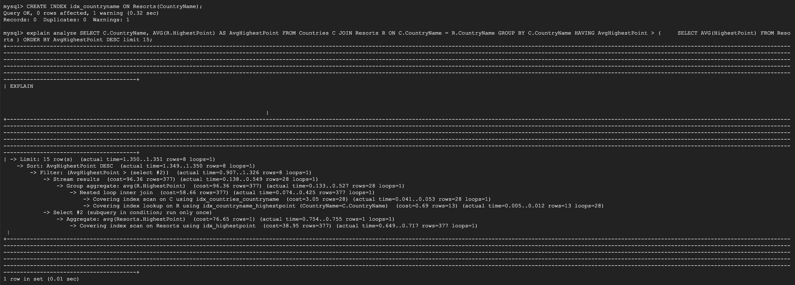

After adding the index on CountryName did not reduce the query cost because the JOIN operation was already efficient. The query's performance is dominated by the HAVING clause, which involves aggregation and filtering, tasks that the index on CountryName cannot optimize.

#### Conclusion:

We chose the composite index on CountryName and HighestPoint as the final design because it effectively reduced the overall query cost by optimizing both the JOIN and the HAVING clause. This indexing strategy best matched the query’s needs and led to a clear improvement in performance.

### Query 2

- Default Index:

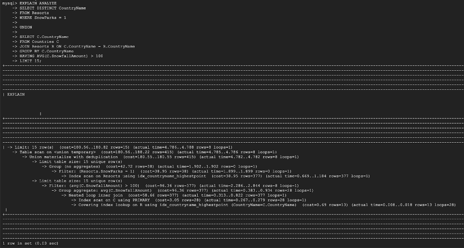

We first ran the EXPLAIN ANALYZE command on the original advanced query to measure its performance and the cost was 180.56.

- Add an index on SnowParks:

This column is used in the WHERE clause to filter resorts that have snow parks (SnowParks = 1). Indexing this column could speed up the filtering process by allowing the database to find relevant rows faster, instead of scanning the entire table.

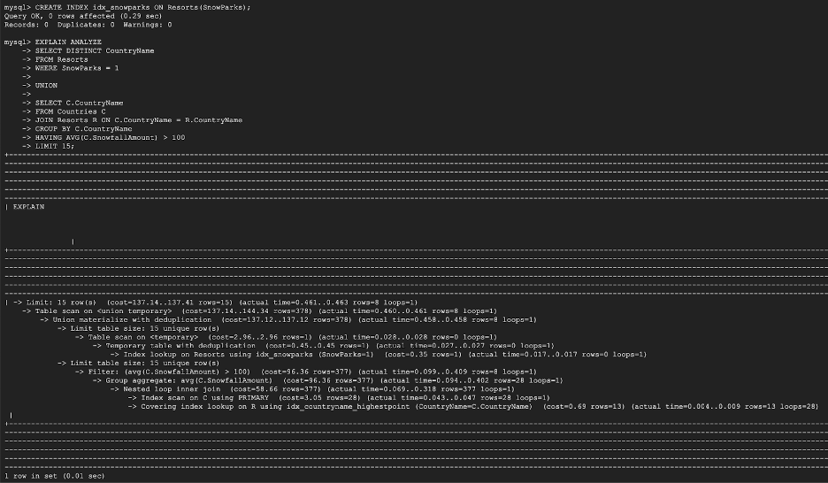

After adding an index on the SnowParks column, the query cost decreased from 180.56 to 137.14. This reduction indicates that the index successfully optimized the filtering process in the WHERE SnowParks = 1 clause. The query now performs an efficient index lookup instead of a full table scan, speeding up the first part of the query.

- Add an index on SnowfallAmount:

This column is used in the HAVING clause to filter countries based on the average snowfall amount. Indexing this column could improve the performance of the aggregation (AVG(SnowfallAmount)).

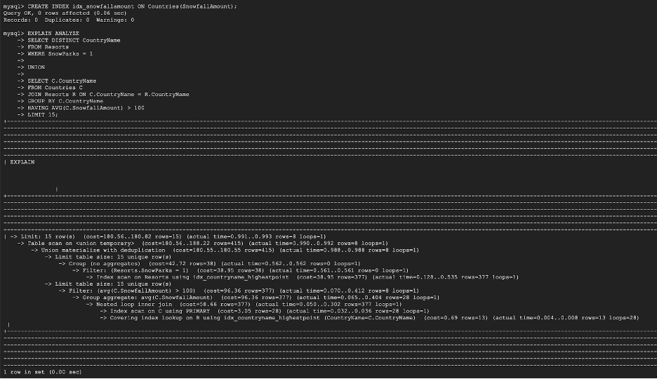

After adding the index on SnowfallAmount, the query cost remained 180.56, showing no improvement in performance. This is likely because the query involves an aggregation (AVG(SnowfallAmount)) in the HAVING clause, where indexing is less effective. The database still needs to process all the rows to calculate the average, and the index doesn’t reduce the workload in this case.

- Add an Index on CountryName:
  
This column is used in the JOIN clause to connect the Countries table with the Resorts table (ON C.CountryName = R.CountryName). Indexing this column could improve the performance of the JOIN operation by allowing faster lookups for matching rows.

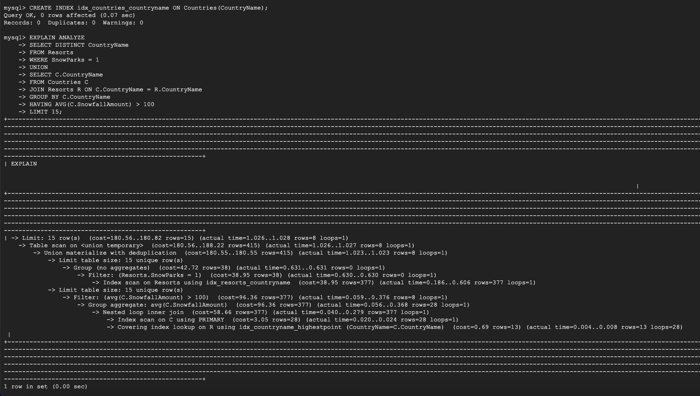

After adding the index on CountryName, the total query cost remained 180.56, which means there is no improvement in performance. This is likely because the JOIN operation on CountryName was already efficient due to other optimizations, and the aggregation in the HAVING clause continues to dominate the query cost. Also, the database still needs to process all the rows to calculate the AVG(SnowfallAmount) for each country, which limits the effectiveness of this index in reducing overall query cost.

#### Conclusion:

We selected the index on SnowParks as the most effective, which reduces the query cost from 180.56 to 137.14. This index optimized the WHERE clause by quickly filtering resorts with snow parks. However, the index on SnowfallAmount and  CountryName had no impact on the query cost, likely due to the aggregation in the HAVING and taking averages clause required scanning all rows. 

### Query 3

- Default Index:

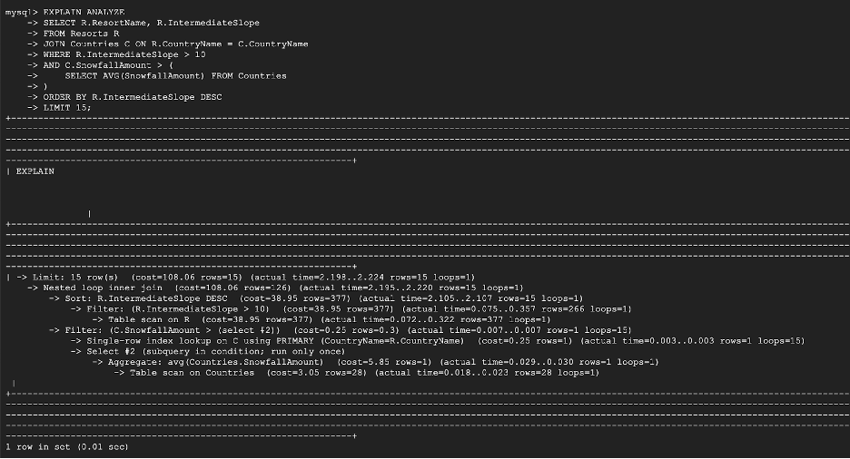

We first ran the EXPLAIN ANALYZE command on the original advanced query to measure its performance and the cost was 108.06.

- Add an index on IntermediateSlope:

This column is used in the WHERE clause to filter resorts where IntermediateSlope > 10. Adding an index on this column could help speed up the filtering process.

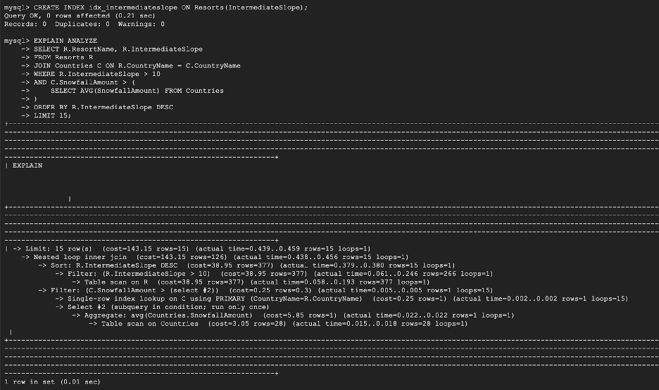

After adding the index on IntermediateSlope, the query cost increased from 108.06 to 143.15. The index didn't help because many rows still match IntermediateSlope > 10, and the overhead of using the index made the query slower. As a result, indexing IntermediateSlope was not effective in improving performance.

- Add an index on SnowfallAmount:

The subquery uses SnowfallAmount in the WHERE clause and as an aggregation for calculating the average. Indexing this column might improve the performance of this subquery and the overall query.

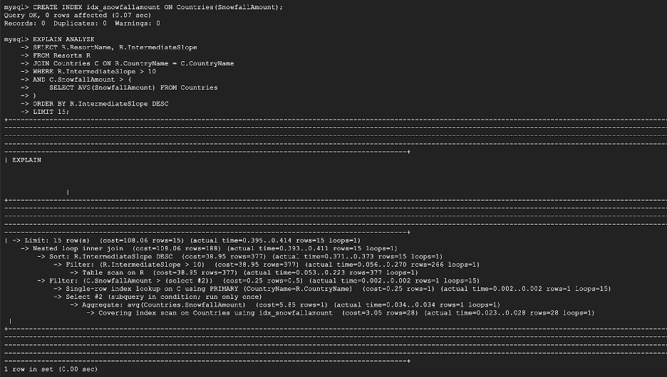

After adding the index on SnowfallAmount, the query cost remained the same at 108.06. The index did not improve performance because the query still needs to process most rows to calculate the average SnowfallAmount. Since the aggregation requires scanning the entire table, the index provided little to no benefit in reducing the query cost. Therefore, indexing SnowfallAmount was not effective in this case.

- Add an Index on CountryName and SnowfallAmount:

This compound index is used in the JOIN clause to connect the Countries table with the Resorts table (ON R.CountryName = C.CountryName) and to filter countries based on the SnowfallAmount column in the WHERE condition. Indexing these columns together may optimize both operations.

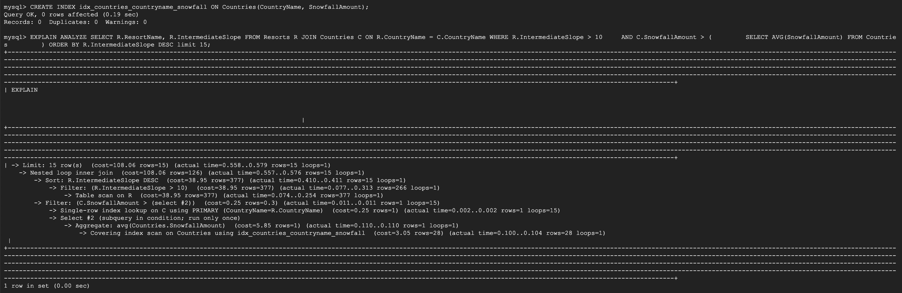

After adding the index on CountryName and SnowfallAmount, the query cost remained 108.06, showing no improvement in performance. This is because first, the subquery SELECT AVG(SnowfallAmount) FROM Countries is executed once and requires a full scan of Countries to compute the aggregate. Then, since the JOIN is already efficient, it uses PRIMARY keys or other indices. Adding this index had no big effect on query performance.

#### Conclusion:

All indexing attempts did not improve query performance. Adding an index on IntermediateSlope actually increased the query cost due to the high number of matching rows, leading to more overhead. Similarly, adding an index on SnowfallAmount had no impact, as the query still needed to scan most rows to compute the average. In these cases, indexing was not effective for optimizing the query.

### Query 4

- Default Index:

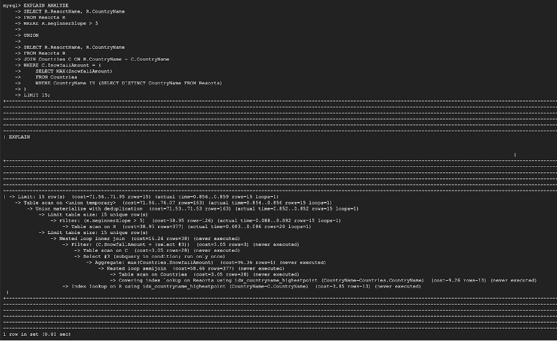

We first ran the EXPLAIN ANALYZE command on the original advanced query to measure its performance and the cost was 71.56.

- Add an index on BeginnerSlope:

Since the query filters Resorts based on BeginnerSlope > 5, adding an index on BeginnerSlope could help reduce the filtering cost.

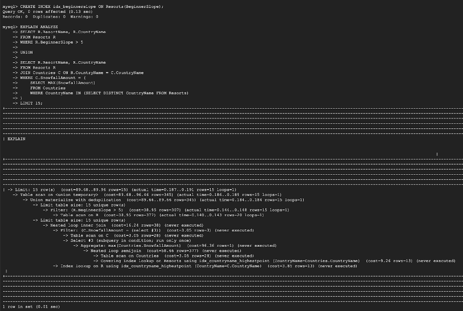

After adding the index on BeginnerSlope, the query cost increased from 71.56 to 89.68. The index didn’t help because the filter still had to scan many rows, making it ineffective. The subquery cost also stayed the same. Overall, the index on BeginnerSlope made the query slower instead of faster.

- Add an index on SnowfallAmount:

The column SnowfallAmount is crucial for the subquery that calculates the MAX(SnowfallAmount) for countries associated with resorts. By indexing this column, we can speed up the process of finding the maximum value without scanning the entire table.

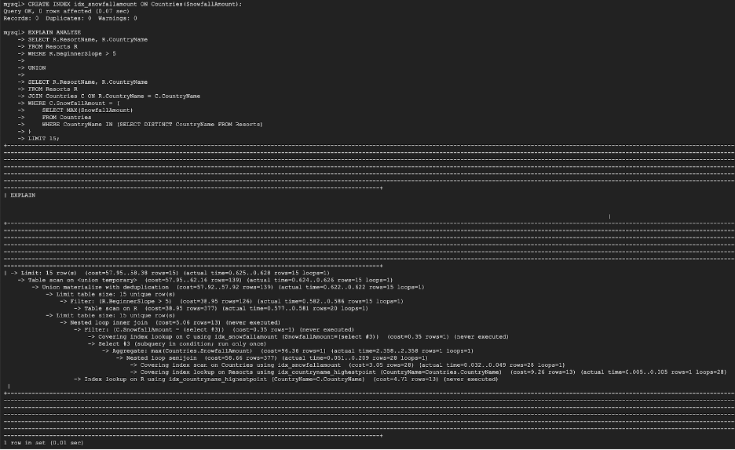

After creating the index on SnowfallAmount, the query cost reduced from 71.56 to 57.95, indicating a clear improvement in performance. The index helped optimize the subquery, allowing it to quickly find the maximum snowfall without a full table scan. This, in turn, reduced the cost of the UNION operation as well, making the query more efficient overall.

- Add an Index on CountryName and BeginnerSlope:

This compound index is used to optimize the filtering on BeginnerSlope > 5 and the JOIN operation on CountryName. Indexing these columns together aims to enhance both filtering and the efficiency of combining results in the UNION operation.

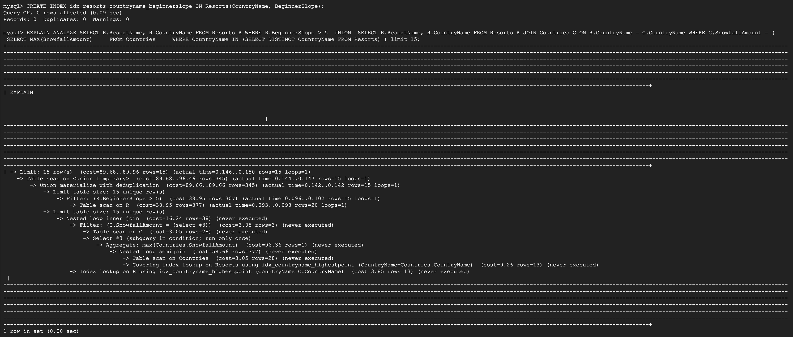

After adding the index on CountryName and BeginnerSlope, the query cost increased from 71.56 to 89.68. This indicates that the index did not improve performance and instead added overhead to the query execution.This did not improve performance because the filtering condition (BeginnerSlope > 5) matched too many rows, reducing the index's selectivity, and the query's cost was dominated by the subquery and sorting operations, which the index did not address.

#### Conclusion:

We selected the index on SnowfallAmount as the most effective, reducing the query cost from 71.56 to 57.95. This index optimized the subquery by quickly identifying the maximum snowfall amount. In contrast, adding an index on BeginnerSlope or a compound index on CountryName and BeginnerSlope both increased the query cost, as it didn’t effectively reduce the number of rows scanned.
